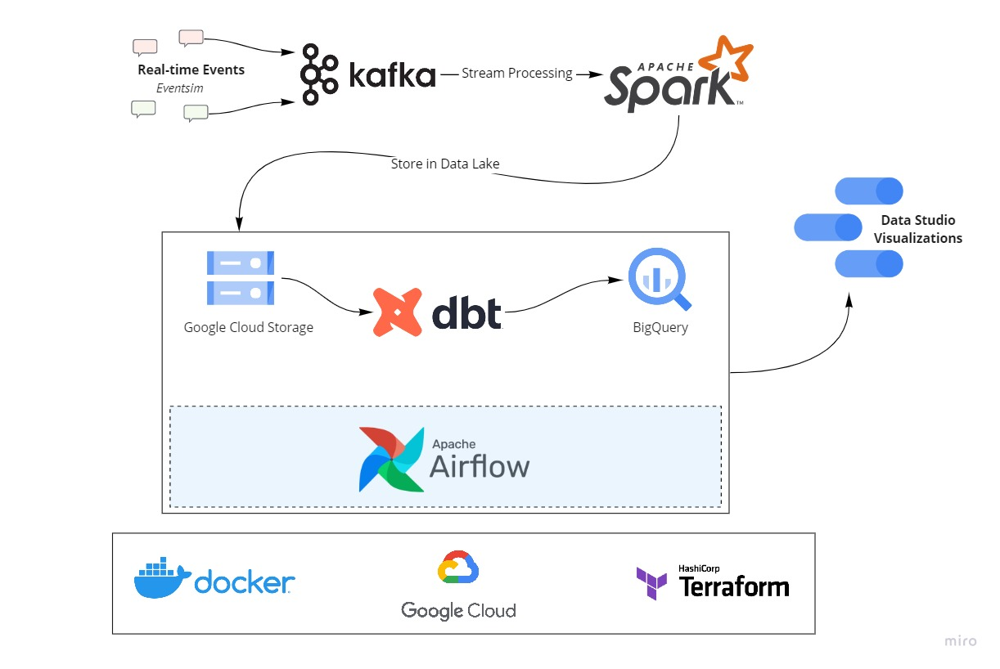

A data pipeline with Kafka, Spark Streaming, dbt, Docker, Airflow, Terraform, GCP and much more!

## Description

### Objectives

1. The project will stream events generated from a fake music streaming service (like Spotify) and create a data pipeline that consumes the real-time data. The data coming in would be similar to an event of a user listening to a song, navigating on the website, authenticating. The data would be processed in real-time and stored to the data lake periodically (every two minutes). The hourly batch job will then consume this data, apply transformations, and create the desired tables for our dashboard to generate analytics. We will try to analyze metrics like popular songs, active users, user demographics etc.

2. In the second part (as extension of part 1), we will apply machine learning algorithms to classify songs into genres using their meta data compiled by The Echo Nest.

    We will be:
    
    a. Preparing the dataset
    b. Splitting them into train and test sets
    c. Normalize the data
    d. Apply PCA on scaled data
    e. Train decision tree and logistic regression compare the performance
    f. Balance the data for better performance
    g. Understanding model bias
    h. Apply cross-validation to evaluate our models

### Dataset

[Eventsim](https://github.com/Interana/eventsim) is a program that generates event data to replicate page requests for a fake music web site. The results look like real use data, but are totally fake. The docker image is borrowed from [viirya's fork](https://github.com/viirya/eventsim) of it, as the original project has gone without maintenance for a few years now.

Eventsim uses song data from [Million Songs Dataset](http://millionsongdataset.com) to generate events. I have used a [subset](http://millionsongdataset.com/pages/getting-dataset/#subset) of 10000 songs.

### Tools & Technologies

- Cloud - [**Google Cloud Platform**](https://cloud.google.com)
- Infrastructure as Code software - [**Terraform**](https://www.terraform.io)
- Containerization - [**Docker**](https://www.docker.com), [**Docker Compose**](https://docs.docker.com/compose/)
- Stream Processing - [**Kafka**](https://kafka.apache.org), [**Spark Streaming**](https://spark.apache.org/docs/latest/streaming-programming-guide.html)
- Orchestration - [**Airflow**](https://airflow.apache.org)
- Transformation - [**dbt**](https://www.getdbt.com)
- Data Lake - [**Google Cloud Storage**](https://cloud.google.com/storage)
- Data Warehouse - [**BigQuery**](https://cloud.google.com/bigquery)
- Data Visualization - [**Data Studio**](https://datastudio.google.com/overview)
- Language - [**Python**](https://www.python.org)

### Architecture



### Final Result


## Setup

**WARNING: You will be charged for all the infra setup. You can avail 300$ in credit by creating a new account on GCP.**
### Pre-requisites

If you already have a Google Cloud account and a working terraform setup, you can skip the pre-requisite steps.

- Google Cloud Platform. 
  - [GCP Account and Access Setup](setup/gcp.md)
  - [gcloud alternate installation method - Windows](https://github.com/DataTalksClub/data-engineering-zoomcamp/blob/main/week_1_basics_n_setup/1_terraform_gcp/windows.md#google-cloud-sdk)
- Terraform
  - [Setup Terraform](https://github.com/DataTalksClub/data-engineering-zoomcamp/blob/main/week_1_basics_n_setup/1_terraform_gcp/windows.md#terraform)


### Get Going!

- Procure infra on GCP with Terraform - [Setup](setup/terraform.md)
- (Extra) SSH into your VMs, Forward Ports - [Setup](setup/ssh.md)
- Setup Kafka Compute Instance and start sending messages from Eventsim - [Setup](setup/kafka.md)
- Setup Spark Cluster for stream processing - [Setup](setup/spark.md)
- Setup Airflow on Compute Instance to trigger the hourly data pipeline - [Setup](setup/airflow.md)


## Part 2 Classification using ML
<h3>1. Preparing our dataset</h3>

```python
import pandas as pd

tracks = pd.read_csv('datasets/fma-rock-vs-hiphop.csv')
echonest_metrics = pd.read_json('datasets/echonest-metrics.json', precise_float=True)

# Merge the relevant columns of tracks and echonest_metrics
echo_tracks = pd.merge(echonest_metrics, tracks[['track_id' , 'genre_top']], how='inner', on='track_id')

# Inspect the resultant dataframe
echo_tracks.info()
```
|   Int64Index: 4802 entries, 0 to 4801   |                       |
|:---------------------------------------:|:---------------------:|
|     Data columns (total 10 columns):    |                       |
|               acousticness              | 4802 non-null float64 |
|               danceability              | 4802 non-null float64 |
|                  energy                 | 4802 non-null float64 |
|             instrumentalness            | 4802 non-null float64 |
|                 liveness                | 4802 non-null float64 |
|               speechiness               | 4802 non-null float64 |
|                  tempo                  | 4802 non-null float64 |
|                 track_id                | 4802 non-null int64   |
|                 valence                 | 4802 non-null float64 |
|                genre_top                | 4802 non-null object  |
| dtypes: float64(8), int64(1), object(1) |                       |
|         memory usage: 412.7+ KB         |                       |


<h3>2. Pairwise relationships between continuous variables</h3>
<p>We want to avoid using variables that have strong correlations with each other -- hence avoiding feature redundancy<br>To get a sense of whether there are any strongly correlated features in our data, we will use built-in functions in the <code>pandas</code> package <code>.corr()</code>. </p>

```python
corr_metrics = echo_tracks.corr()
corr_metrics.style.background_gradient()
```
<p align='center'>
  
</p>

<h3>3. Normalizing the feature data</h3>
<p>Since we didn't find any particular strong correlations between our features, we can instead use a common approach to reduce the number of features called <b>principal component analysis (PCA)</b><br>To avoid bias, I first normalize the data using <code>sklearn</code> built-in <code>StandardScaler</code> method</p>

```python
from sklearn.preprocessing import StandardScaler

features = echo_tracks.drop(['track_id', 'genre_top'], axis=1)
labels = echo_tracks.genre_top

scaler = StandardScaler()
scaled_train_features = scaler.fit_transform(features)
```

<h3>4. Principal Component Analysis on our scaled data</h3>
<p>Now PCA is ready to determine by how much we can reduce the dimensionality of our data. We can use <b>scree-plots</b> and <b>cumulative explained ratio plots</b> to find the number of components to use in further analyses.<br>When using scree plots, an 'elbow' (a steep drop from one data point to the next) in the plot is typically used to decide on an appropriate cutoff.</p>
  
```python
from sklearn.decomposition import PCA

pca = PCA()
pca.fit(scaled_train_features)

exp_variance = pca.explained_variance_ratio_

fig, ax = plt.subplots()
ax.bar(range(pca.n_components_), exp_variance)
```


<p>Unfortunately, there does not appear to be a clear elbow in this scree plot, which means it is not straightforward to find the number of intrinsic dimensions using this method.</p>

<h3>5. Further visualization of PCA</h3>
<p>Let's nownlook at the <b>cumulative explained variance plot</b> to determine how many features are required to explain, say, about 85% of the variance</p>

```python
cum_exp_variance = np.cumsum(exp_variance)

fig, ax = plt.subplots()
ax.plot(cum_exp_variance)
ax.axhline(y=0.85, linestyle='--')

# choose the n_components where about 85% of our variance can be explained
n_components = 6

pca = PCA(n_components, random_state=10)
pca.fit(scaled_train_features)
pca_projection = pca.transform(scaled_train_features)
```


<h3>6. Train a decision tree to classify genre</h3>
<p>Now we can use the lower dimensional PCA projection of the data to classify songs into genres. we will be using a simple algorithm known as a <b>decision tree</b>.</p>

```python
from sklearn.model_selection import train_test_split
from sklearn.tree import DecisionTreeClassifier

train_features, test_features, train_labels, test_labels = train_test_split(pca_projection, labels, random_state=10)

tree = DecisionTreeClassifier(random_state=10)
tree.fit(train_features, train_labels)

pred_labels_tree = tree.predict(test_features)
```

<h3>7. Compare our decision tree to a logistic regression</h3>
<p>There's always the possibility of other models that will perform even better! Sometimes simplest is best, and so we will start by applying <b>logistic regression</b>.</p>

```python
from sklearn.linear_model import LogisticRegression
from sklearn.metrics import classification_report

logreg = LogisticRegression(random_state=10)
logreg.fit(train_features, train_labels)
pred_labels_logit = logreg.predict(test_features)

class_rep_tree = classification_report(test_labels, pred_labels_tree)
class_rep_log = classification_report(test_labels, pred_labels_logit)

print("Decision Tree: \n", class_rep_tree)
print("Logistic Regression: \n", class_rep_log)
```

| Decision Tree: |        |          |         |      |  
|----------------|--------|----------|---------|------|
| precision      | recall | f1-score | support |      |
| Hip-Hop        | 0.66   | 0.66     | 0.66    | 229  |
| Rock           | 0.92   | 0.92     | 0.92    | 972  |
| avg / total    | 0.87   | 0.87     | 0.87    | 1201 |

| Logistic Regression: |        |          |         |      |
|----------------------|--------|----------|---------|------|
| precision            | recall | f1-score | support |      |
| Hip-Hop              | 0.75   | 0.57     | 0.65    | 229  |
| Rock                 | 0.90   | 0.95     | 0.93    | 972  |
| avg / total          | 0.87   | 0.88     | 0.87    | 1201 | 


<h3>8. Using cross-validation to evaluate our models</h3>
<p>To get a good sense of how well our models are actually performing, we can apply what's called <b>cross-validation</b> (CV).

```python
from sklearn.model_selection import KFold, cross_val_score

kf = KFold(n_splits=10)

tree = DecisionTreeClassifier(random_state=10)
logreg = LogisticRegression(random_state=10)

tree_score = cross_val_score(tree,pca_projection, labels, cv=kf)
logit_score = cross_val_score(logreg,pca_projection, labels, cv=kf)

print("Decision Tree:", tree_score)
>>> Decision Tree: [0.6978022  0.6978022  0.69230769 0.78571429 0.71978022 0.67032967 0.75824176 0.76923077 0.75274725 0.6978022 ]
print("Logistic Regression:", logit_score)
>>> Logistic Regression: [0.79120879 0.76373626 0.78571429 0.78571429 0.78571429 0.78021978 0.75274725 0.76923077 0.81868132 0.71978022]
```

<h4> Success! </h4>

